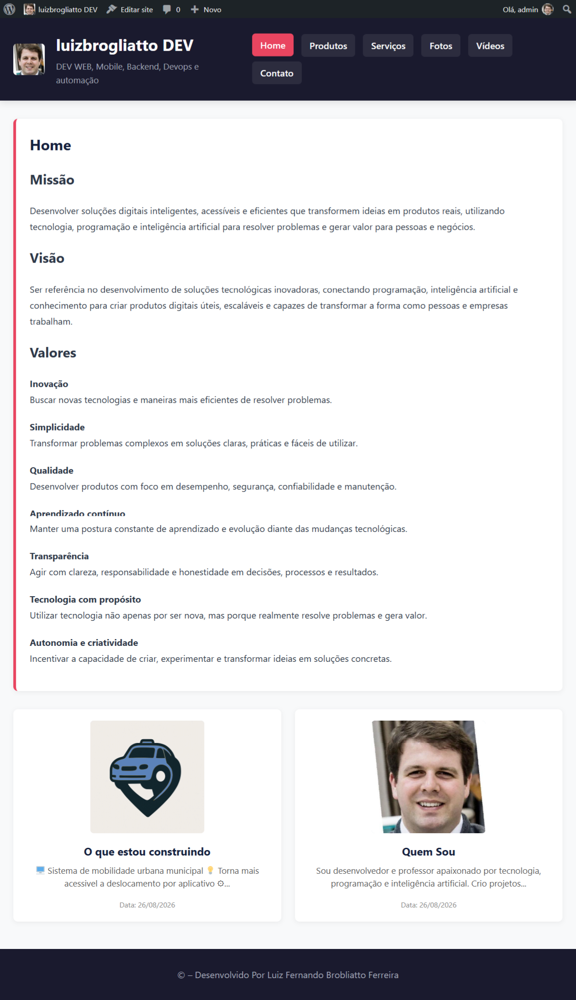

## Screenshot




## 🚀 Demo

**[👉 Acessar demonstração online](https://luizbrogliatto.freedev.app/home/)**

# Tema e Plugin Estudo WordPress - API REST e Arquitetura MVC

Este repositório contém a documentação e a implementação de um ambiente de desenvolvimento completo em **WordPress**, integrando um **Plugin Customizado (`plugin_estudo`)** construído sobre a arquitetura **MVC (Model-View-Controller)** com suporte a **API REST customizada**, e um **Tema Customizado (`tema_estudo`)** integrado via chamadas assíncronas em JavaScript modular e suporte a Full Site Editing (FSE).

---

## 📋 Sumário

1. [Visão Geral do Projeto](#-visão-geral-do-projeto)
2. [Arquivos da Raiz do Repositório](#1-arquivos-da-raiz-do-repositório)
3. [Plugin Customizado: `plugin_estudo`](#2-plugin-customizado-plugin_estudo)
   - [Arquivos Raiz do Plugin](#21-arquivos-raiz-do-plugin)
   - [Arquitetura Interna (`includes/`)](#22-diretório-includes-arquitetura-interna)
   - [Endpoints da API REST (`api/v1`)](#23-endpoints-da-api-rest-apiv1)
4. [Tema Customizado: `tema_estudo`](#3-tema-customizado-tema_estudo)
   - [Arquivos Core e Templates PHP/HTML](#31-arquivos-core-e-templates-phphtml)
   - [Módulo de Scripts JavaScript (`assets/js/`)](#32-módulo-de-scripts-javascript-assetsjs)
5. [Instalação e Configuração](#-instalação-e-configuração)

---

## 🚀 Visão Geral do Projeto

O objetivo deste projeto é demonstrar a estruturação de uma aplicação moderna no WordPress separando claramente as responsabilidades:

- **Camada de Dados (Model & DB):** Abstração de queries customizadas no banco de dados WordPress e migrações próprias.
- **Camada de Negócio (Services):** Validações, tratamento de payloads e regras intermediárias da aplicação.
- **Camada de Apresentação e Contrato (Controllers & REST API):** Disponibilização de rotas REST seguras sob o namespace `api/v1` com suporte a autenticação por Token JWT.
- **Camada Visual e Scripts Assíncronos (Tema):** Interface frontend responsiva com suporte a blocos Gutenberg/FSE e consumo dinâmico e modular da API REST via arquitetura JavaScript organizada.

---

## 1. Arquivos da Raiz do Repositório

Configurações globais de controle de versão, ambiente do servidor local e documentação do projeto.

| Arquivo / Diretório | Tipo | Função e Descrição |
| :--- | :--- | :--- |
| `wp-content/` | **Diretório** | Diretório padrão do WordPress contendo todos os temas, plugins, uploads e conteúdos customizados do projeto. |
| `.gitignore` | **Configuração** | Lista arquivos e pastas (como dependências do Composer `vendor/` ou credenciais sensíveis `.env`) a serem ignorados pelo Git. |
| `.htaccess` | **Servidor** | Arquivo de configuração do servidor Apache/IIS responsável por regras de reescrita de URL (Permalinks) e segurança. |
| `arquivos.txt` / `lista...` | **Logs / Auxiliar** | Arquivos utilitários locais de anotações e listagens de diretórios. |
| `README.md` | **Documentação** | Arquivo principal Markdown contendo a introdução, tabelas explicativas, arquitetura do projeto e guia de uso. |

---

## 2. Plugin Customizado: `plugin_estudo`

Localizado em `wp-content/plugins/plugin_estudo`, este plugin implementa uma arquitetura modular baseada em serviços, modelos, controladores e integração com banco de dados próprio e API REST.

### 2.1. Arquivos Raiz do Plugin

| Arquivo / Diretório | Tipo | Função e Descrição |
| :--- | :--- | :--- |
| `plugin_estudo.php` | **PHP Principal** | Arquivo principal do plugin. Contém o cabeçalho de metadados exigido pelo WordPress e inicializa o carregamento das classes. |
| `config.php` | **Configuração** | Define constantes globais e parâmetros de configuração do plugin. |
| `autoload2.php` | **Autoloader** | Gerencia o carregamento automático de classes PHP do plugin de forma modular. |
| `composer.json` / `composer.lock` | **Dependências** | Gerenciador de pacotes Composer para controle de bibliotecas e dependências externas (ex: Firebase JWT). |
| `env.php` / `.env.example.php` | **Ambiente** | Gerenciamento de variáveis de ambiente e chaves de configuração sensíveis. |

### 2.2. Diretório `includes/` (Arquitetura Interna)

A pasta `includes/` organiza o código do plugin segundo o padrão de arquitetura em camadas (MVC + Services + DB):

| Subpasta / Arquivo | Tipo | Função e Descrição |
| :--- | :--- | :--- |
| `controllers/` | **Controller** | Controladores de rotas e lógica de requisições, incluindo a inicialização de rotas em `_register_rest_route.php`. |
| `controllers/wordpress_api/` | **API Endpoints** | Controladores específicos para endpoints REST: `categories_controller.php`, `products_controller.php`, `posts_controller.php`, `pages_controller.php`, `settings_controller.php`, `login_api_controller.php`. |
| `db/` | **Banco de Dados** | Gerencia migrações (`_migrate.php`) e operações de tabelas de banco de dados personalizadas (ex: `user_login_db.php`). |
| `models/` | **Model** | Camada de abstração de dados e mapeamento: `wp_categories_model.php`, `wp_users_model.php`, `wp_posts_data_model.php`, `wp_pages_model.php`, `wp_products_model.php`, `_model_db.php`. |
| `services/` | **Services** | Camada de regras de negócios intermediária entre os controllers e modelos (`categories_service.php`, `products_service.php`, `login_api_service.php`, `pages_service.php`, `posts_service.php`, `settings_service.php`). |

### 2.3. Endpoints da API REST (`api/v1`)

| Endpoint | Método HTTP | Controlador | Descrição |
| :--- | :--- | :--- | :--- |
| `/wp-json/api/v1/categories` | `GET` | `CategoriesController` | Retorna a listagem de categorias com suporte a paginação e parâmetros. |
| `/wp-json/api/v1/categories/{id}` | `GET` | `CategoriesController` | Retorna os dados detalhados de uma categoria por ID. |
| `/wp-json/api/v1/products` | `GET` | `ProductsController` | Retorna a listagem de produtos com paginação. |
| `/wp-json/api/v1/products/{id}` | `GET` | `ProductsController` | Retorna os detalhes de um produto específico por ID. |
| `/wp-json/api/v1/posts` | `GET` | `PostsController` | Retorna posts cadastrados no WordPress via API REST. |
| `/wp-json/api/v1/pages` | `GET` | `PagesController` | Retorna páginas cadastradas no WordPress. |
| `/wp-json/api/v1/settings` | `GET` / `POST` | `SettingsController` | Gerencia configurações gerais da API e do plugin. |
| `/wp-json/api/v1/login` | `POST` | `LoginApiController` | Autentica o usuário e gera o token de acesso (JWT). |
| `/wp-json/api/v1/logout` | `POST` | `LoginApiController` | Encerra a sessão do usuário autenticado. |
| `/wp-json/api/v1/new_token` | `POST` | `LoginApiController` | Gera/renova o token JWT de acesso. |
| `/wp-json/api/v1/verify` | `POST` | `LoginApiController` | Valida a autenticidade e validade do token JWT. |

---

## 3. Tema Customizado: `tema_estudo` (React SPA)

Localizado em `wp-content/themes/tema_estudo`, este tema opera como uma **Single Page Application (SPA)** moderna construída com **React 18**, **Vite** e **React Router v6**, integrada de forma híbrida ao WordPress e à REST API do `plugin_estudo`.

> 📘 Para a documentação técnica completa do frontend, consulte o guia detalhado: **[docs/ARQUITETURA_REACT_SPA.md](docs/ARQUITETURA_REACT_SPA.md)**.

### 3.1. Arquivos Core e Casca PHP

O WordPress atua como a casca (Shell) que inicializa o ambiente, enfileira os assets compilados e injeta os metadados da API via `wp_localize_script`:

| Arquivo / Diretório | Tipo | Função e Descrição |
| :--- | :--- | :--- |
| `index.php` | **React SPA Shell** | Ponto de montagem da aplicação frontend contendo o `<div id="root"></div>`. |
| `functions.php` | **Tema Core** | Enfileira os bundles compilados (`assets/dist/app.js` e `app.css`), injeta a configuração global `window.EstudoApiConfig` e registra controles no WordPress Customizer. |
| `header.php` / `footer.php` | **Estrutura Base** | Tags `<!DOCTYPE html>`, chamadas `wp_head()`, `wp_body_open()` e `wp_footer()`. |
| `page.php` / `single.php` / `archive.php` / `category.php` / `404.php` | **Templates de Encaminhamento** | Delegam a renderização para a casca `index.php`, permitindo que o React Router controle as rotas da SPA. |
| `style.css` | **Metadados** | Cabeçalho exigido pelo WordPress (Nome do tema, Versão, Autor) e folha de estilos base. |
| `theme.json` | **Configuração** | Definições de paleta de cores, tipografia e layout do WordPress. |
| `assets/dist/` | **Bundle Compilado** | Contém `app.js` e `app.css` gerados automaticamente pelo Vite. |

### 3.2. Estrutura do Frontend React (`src/`)

| Diretório / Arquivo | Responsabilidade |
| :--- | :--- |
| `src/main.jsx` | Ponto de entrada JavaScript. Calcula dinamicamente o basename da URL e monta o React no elemento `#root`. |
| `src/App.jsx` | Componente mestre com layout, Header, Navbar, Footer, Modal de Autenticação e rotas principais. |
| `src/components/` | Componentes modulares reutilizáveis: `Header.jsx`, `Navbar.jsx`, `Footer.jsx`, `AuthModal.jsx`, `CategoryBanner.jsx`, `NavbarCustomizer.jsx` e `PostCard.jsx`. |
| `src/pages/` | Visões da aplicação: `FeedPage.jsx`, `SingleItemPage.jsx` (posts/produtos) e `NotFoundPage.jsx`. |
| `src/context/` | Gerenciamento de estado global: `AuthContext.jsx` para controle de sessão e tokens JWT. |
| `src/services/` | Comunicação com o backend: `api.js` para consumo resiliente das rotas REST de `/wp-json/api/v1/`. |
| `src/index.css` | Folha de estilos com design system moderno (Dark Navy, Glassmorphism, animações e responsividade). |

### 3.3. Ciclo de Build e Geração Automática do `.zip`

O tema possui integração nativa entre o Vite e o empacotamento do WordPress:

```bash
cd wp-content/themes/tema_estudo
npm install
npm run build
```

Ao executar `npm run build`:
1. O **Vite** compila e minifica todo o código React para `assets/dist/app.js` e `assets/dist/app.css`.
2. O hook `postbuild` executa `scripts/create-zip.js`.
3. O pacote de instalação otimizado **`wp-content/themes/tema_estudo.zip`** (~653 KB) é gerado automaticamente, sem arquivos de desenvolvimento (`node_modules`), pronto para upload no painel do WordPress (`Aparência > Temas > Enviar tema`).


---

## 🛠️ Instalação e Configuração

### 1. Clonar o Repositório e Estrutura de Pastas

Navegue até a raiz da sua instalação do WordPress e posicione os diretórios:

- **Plugin:** `wp-content/plugins/plugin_estudo`
- **Tema:** `wp-content/themes/tema_estudo`

```bash
git clone https://github.com/luiz0067yahoo/tema-e-plugin-estudo-wordpress.git
```

### 2. Instalação das Dependências via Composer

Navegue até o diretório do plugin customizado e execute o comando do Composer para baixar e instalar os pacotes necessários (como a biblioteca Firebase JWT):

```bash
cd wp-content/plugins/plugin_estudo
composer install
```

### 3. Configuração de Variáveis de Ambiente (`.env`)

Ainda na pasta do plugin (`wp-content/plugins/plugin_estudo`), crie o arquivo `env.php` a partir do modelo de exemplo:

```bash
cp .env.example.php env.php
```

Abra o arquivo `env.php` em seu editor e ajuste as chaves de segurança e o namespace da API REST:

```php
<?php

define('JWT_SECRET_KEY', 'sua_chave_secreta_jwt_aqui');
define('JWT_ALGORITHM', 'HS256');
define('API_NAMESPACE', 'api/v1');
```

> **Importante:** não versione chaves secretas ou credenciais reais no Git. Utilize o arquivo de exemplo para documentar a configuração necessária.

### 4. Configuração de Permalinks no WordPress

Para garantir o correto funcionamento das rotas REST sob o namespace `/wp-json/api/v1/`:

1. Acesse o painel administrativo do WordPress (`/wp-admin`).
2. Vá em **Configurações > Links Permanentes**.
3. Selecione a opção **Nome do post**.
4. Clique em **Salvar alterações** para atualizar as regras de reescrita do Apache/NGINX.

### 5. Ativação do Plugin

1. No painel do WordPress, vá em **Plugins > Plugins Instalados**.
2. Localize o **Plugin Estudo**.
3. Clique em **Ativar**.

> **Nota:** durante a ativação, o script `_migrate.php` criará automaticamente as tabelas customizadas necessárias no banco de dados.

### 6. Ativação do Tema

1. No painel do WordPress, vá em **Aparência > Temas**.
2. Localize o **Tema Estudo**.
3. Clique em **Ativar**.

---

## 🧩 Arquitetura

A organização do projeto pode ser representada conceitualmente da seguinte forma:

```text
WordPress
│
├── wp-content/
│   │
│   ├── plugins/
│   │   └── plugin_estudo/
│   │       ├── plugin_estudo.php
│   │       ├── config.php
│   │       ├── env.php
│   │       ├── composer.json
│   │       └── includes/
│   │           ├── controllers/
│   │           │   └── wordpress_api/
│   │           ├── services/
│   │           ├── models/
│   │           └── db/
│   │
│   └── themes/
│       └── tema_estudo/
│           ├── functions.php
│           ├── index.php (Root SPA Shell)
│           ├── header.php / footer.php
│           ├── page.php / single.php / archive.php
│           ├── style.css
│           ├── theme.json
│           ├── vite.config.js
│           ├── package.json
│           ├── scripts/
│           │   └── create-zip.js
│           ├── src/
│           │   ├── main.jsx
│           │   ├── App.jsx
│           │   ├── components/
│           │   ├── pages/
│           │   ├── context/
│           │   └── services/
│           └── assets/
│               └── dist/
│                   ├── app.js
│                   └── app.css
```

---

## 🔄 Fluxo da Aplicação

```text
Frontend / Tema
       │
       ▼
JavaScript Modular
       │
       ▼
API REST /api/v1
       │
       ▼
Controllers
       │
       ▼
Services
       │
       ▼
Models
       │
       ▼
Banco de Dados
```

Para autenticação:

```text
Cliente
   │
   ▼
POST /wp-json/api/v1/login
   │
   ▼
LoginApiController
   │
   ▼
LoginApiService
   │
   ▼
JWT
   │
   ▼
Cliente autenticado
```

---

## 🔐 Autenticação JWT

O projeto utiliza **JSON Web Token (JWT)** para autenticação da API.

Os principais endpoints relacionados à autenticação são:

| Endpoint | Método | Finalidade |
| :--- | :---: | :--- |
| `/wp-json/api/v1/login` | `POST` | Autenticar usuário e gerar token JWT |
| `/wp-json/api/v1/logout` | `POST` | Encerrar sessão |
| `/wp-json/api/v1/new_token` | `POST` | Gerar ou renovar token |
| `/wp-json/api/v1/verify` | `POST` | Validar token JWT |

A chave utilizada para assinatura do token deve permanecer privada e não deve ser publicada no repositório.

---

## 🌐 API REST

Namespace principal:

```text
/wp-json/api/v1/
```

Exemplo:

```text
https://seu-dominio.com/wp-json/api/v1/products
```

### Categorias

```http
GET /wp-json/api/v1/categories
GET /wp-json/api/v1/categories/{id}
```

### Produtos

```http
GET /wp-json/api/v1/products
GET /wp-json/api/v1/products/{id}
```

### Posts

```http
GET /wp-json/api/v1/posts
```

### Páginas

```http
GET /wp-json/api/v1/pages
```

### Configurações

```http
GET  /wp-json/api/v1/settings
POST /wp-json/api/v1/settings
```

### Autenticação

```http
POST /wp-json/api/v1/login
POST /wp-json/api/v1/logout
POST /wp-json/api/v1/new_token
POST /wp-json/api/v1/verify
```

---

## 🧰 Tecnologias

- **WordPress**
- **PHP**
- **MySQL**
- **React 18**
- **Vite**
- **React Router v6**
- **REST API**
- **JWT (JSON Web Token)**
- **Composer**
- **MVC (Model-View-Controller)**
- **CSS Moderno / Glassmorphism**

---

## 📁 Estrutura de Responsabilidades

| Camada | Responsabilidade |
| :--- | :--- |
| **Models** | Acesso e abstração dos dados |
| **DB** | Migrações e operações específicas do banco |
| **Services** | Regras de negócio e tratamento dos dados |
| **Controllers** | Processamento das requisições e exposição da API |
| **REST API** | Contrato de comunicação entre frontend e backend |
| **JavaScript** | Consumo da API e renderização dinâmica |
| **Tema** | Interface e experiência do usuário |
| **WordPress** | CMS e infraestrutura principal |

---

## 🚀 Primeiros Passos

Depois de instalar e configurar o projeto:

1. Instale as dependências com Composer.
2. Configure o `env.php`.
3. Configure os links permanentes.
4. Ative o plugin.
5. Ative o tema.
6. Verifique os endpoints REST.
7. Teste a autenticação JWT.
8. Acesse o frontend e valide o consumo da API.

---

## ⚠️ Segurança

Nunca publique no Git:

- Chaves JWT reais.
- Senhas.
- Tokens.
- Credenciais de banco de dados.
- Arquivos `.env` ou equivalentes contendo informações sensíveis.

O arquivo `.env.example.php` deve conter somente valores de exemplo.

---

## 📄 Licença

A licença do projeto não foi especificada na documentação fornecida.

Caso o projeto seja publicado como código aberto, recomenda-se definir explicitamente uma licença, como MIT, GPL-2.0 ou GPL-3.0, antes da distribuição.

---

## 👨‍💻 Autor

**Luiz Fernando Brogliatto Ferreira**

Projeto de estudo e desenvolvimento de arquitetura WordPress com:

- Plugin customizado;
- Tema customizado;
- Arquitetura MVC;
- API REST;
- Autenticação JWT;
- JavaScript modular;
- Gutenberg/FSE.

---

## 🔗 Repositório

[GitHub - tema-e-plugin-estudo-wordpress](https://github.com/luiz0067yahoo/tema-e-plugin-estudo-wordpress)
